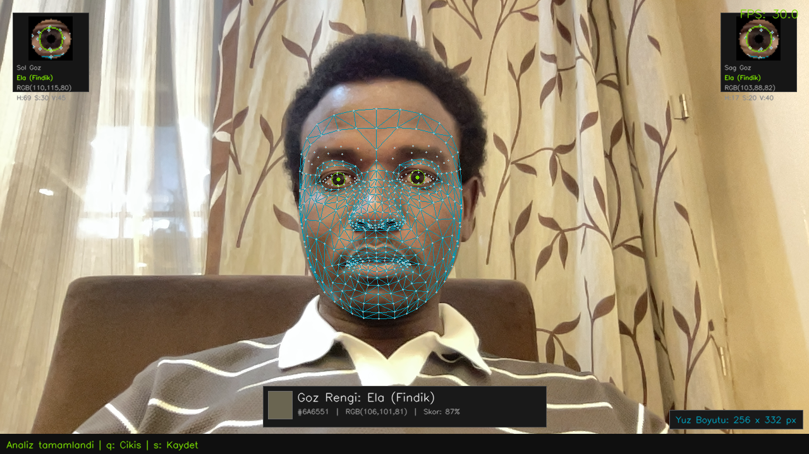
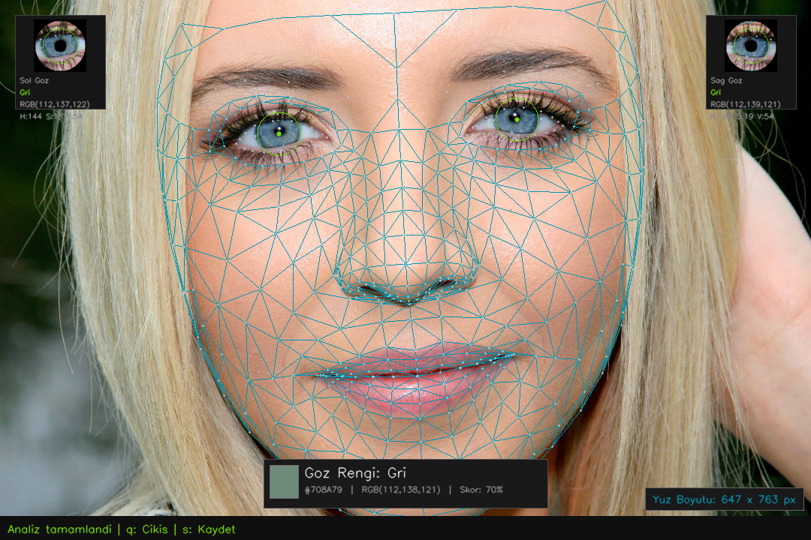

# 👁️ Iris Color Detector | Göz Rengi Tespiti Uygulaması

🌍 **Language:** [English](#english) | [Türkçe](#türkçe)


---

<a name="english"></a>
## 🇬🇧 English

This project is an advanced application that uses image processing and AI techniques to detect irises on the face and analyze eye color. It can run live via a webcam or on static images.

### 🌟 Features

- **High Accuracy:** Precise eye detection using the MediaPipe Face Mesh framework.
- **Color Analysis:** Advanced algorithms (K-Means Clustering & LAB Space distance) to determine the true color in the center of the iris while intelligently filtering out reflections and shadows.
- **Live Mode:** Real-time and smooth analysis via webcam (including FPS and face dimension indicators).
- **Photo Mode:** Detailed analysis on uploaded static images.
- **Screenshot Capture:** Instantly save analysis results in live or photo mode.

### 📸 Example Analysis Output

Below are examples of the application's analysis on real-time camera feeds and static photos. Pupils are detected, a professional animated face mask is applied, and color detection is projected onto the screen:

#### 🎥 Live Camera Mode


#### 🖼️ Photo Analysis Mode


### 🛠️ Installation

Follow these steps to run the project locally:

1. **Install Requirements:**
   Install the dependencies based on your environment. On macOS and some Linux distributions, you may need to use `pip3`:
   ```bash
   pip3 install -r requirements.txt
   ```

2. **Start the Project:**
   To start the project in Camera mode (Live analysis):
   ```bash
   python3 main.py
   ```

### 💻 User Guide

When the application is running, you can interact using the following options:

- **🖼️ To Test with a Specific Photo:**
  Run the project by specifying an image path:
  ```bash
  python3 main.py --resim face1.jpg
  ```
  *(Press `s` to save the image, or `q` to exit).*

- **🛑 To Exit the Project:**  
  Press the `q` key on your keyboard.

- **💾 To Take a Screenshot:**  
  Press the `s` key on your keyboard to save the current snapshot to your disk.

---

<a name="türkçe"></a>
## 🇹🇷 Türkçe

Bu proje, görüntü işleme ve yapay zeka tekniklerini kullanarak yüz üzerindeki irisleri tespit eden ve göz rengini analiz eden gelişmiş bir uygulamadır. Kamera üzerinden canlı olarak veya statik görseller üzerinde çalışabilir.

### 🌟 Özellikler

- **Yüksek Doğruluk:** MediaPipe Face Mesh altyapısı ile hassas göz tespiti.
- **Renk Analizi:** Yansıma ve gölgeleri filtreleyerek irisin merkez bölgesindeki gerçek rengi saptamak için gelişmiş yapay zeka algoritmaları (K-Means Clustering & LAB Uzayı).
- **Canlı Mod:** Webcam üzerinden eşzamanlı ve akıcı analiz imkanı (FPS ve yüz boyutu göstergesi dahil).
- **Fotoğraf Modu:** Yüklenen görseller üzerinden detaylı analiz yapabilme.
- **Ekran Görüntüsü Alma:** Canlı modda veya fotoğraf modunda analiz sonuçlarını anında kaydedebilme.

### 📸 Örnek Analiz Çıktısı

Aşağıda uygulamanın gerçek zamanlı kamera ve statik fotoğraflar üzerindeki analizine örnekler verilmiştir. Göz bebekleri algılanmış, profesyonel animasyonlu yüz maskesi uygulanmış ve renk tespiti yapılarak ekrana yansıtılmıştır:

#### 🎥 Canlı Kamera Modu


#### 🖼️ Fotoğraf Analiz Modu


### 🛠️ Kurulum

Projeyi yerel ortamınızda çalıştırmak için aşağıdaki adımları izleyin:

1. **Gereksinimleri Yükleyin:**
   Kullanmakta olduğunuz ortama göre bağımlılıkları yükleyin. macOS ve bazı Linux dağıtımlarında `pip3` kullanmanız gerekebilir:
   ```bash
   pip3 install -r requirements.txt
   ```

2. **Projeyi Başlatın:**
   Kamera modunda (Canlı analiz) projeyi başlatmak için:
   ```bash
   python3 main.py
   ```

### 💻 Kullanım Kılavuzu

Uygulama başlatıldığında aşağıdaki seçeneklerle etkileşime geçebilirsiniz:

- **🖼️ Belirli Bir Fotoğraf ile Test Etmek İçin:**
  Projeyi bir görsel yolu belirterek çalıştırabilirsiniz:
  ```bash
  python3 main.py --resim yuz2.jpg
  ```
  *(Kaydetmek için `s` tuşuna, çıkmak için `q` tuşuna basınız.)*

- **🛑 Projeden Çıkış Yapmak İçin:**  
  Klavyenizden `q` tuşuna basın.

- **💾 Ekran Görüntüsü Almak İçin:**  
  Klavyenizden `s` tuşuna basarak anlık görüntüyü diskinize kaydedebilirsiniz.

---
*Developer / Geliştirici: [Amir-hissein](https://github.com/Amir-hissein)*
