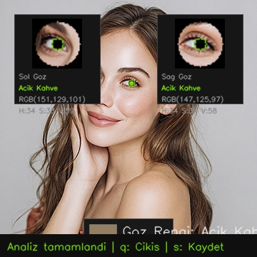

# 👁️ Göz Rengi Tespiti Uygulaması (Iris Color Detector)


Bu proje, görüntü işleme ve yapay zeka tekniklerini kullanarak yüz üzerindeki irisleri tespit eden ve göz rengini analiz eden gelişmiş bir uygulamadır. Kamera üzerinden canlı olarak veya statik görseller üzerinde çalışabilir.

## 🌟 Özellikler

- **Yüksek Doğruluk:** MediaPipe Face Mesh altyapısı ile hassas göz tespiti.
- **Renk Analizi:** Gelişmiş algoritmalar ile irisin merkez bölgesindeki gerçek rengi saptama.
- **Canlı Mod:** Webcam üzerinden eşzamanlı ve akıcı analiz imkanı (FPS göstergesi dahil).
- **Fotoğraf Modu:** Yüklenen görseller üzerinden detaylı analiz yapabilme.
- **Ekran Görüntüsü Alma:** Canlı modda analiz sonuçlarını anında kaydedebilme.

## 📸 Örnek Analiz Çıktısı

Aşağıda uygulamanın fotoğraflar üzerindeki analizine bir örnek verilmiştir. Göz bebekleri algılanmış ve renk tespiti yapılarak ekrana yansıtılmıştır:



## 🛠️ Kurulum

Projeyi yerel ortamınızda çalıştırmak için aşağıdaki adımları izleyin:

1. **Gereksinimleri Yükleyin:**
   Kullanmakta olduğunuz ortama göre bağımlılıkları yükleyin. macOS ve bazı Linux dağıtımlarında `pip3` kullanmanız gerekebilir:
   ```bash
   pip3 install -r requirements.txt
   ```

2. **Projeyi Başlatın:**
   Kamera modunda (Canlı analiz) projeyi başlatmak için:
   ```bash
   python3 main.py
   ```

## 💻 Kullanım Kılavuzu

Uygulama başlatıldığında aşağıdaki seçeneklerle etkileşime geçebilirsiniz:

- **🖼️ Belirli Bir Fotoğraf ile Test Etmek İçin:**
  Projeyi bir görsel yolu belirterek çalıştırabilirsiniz:
  ```bash
  python3 main.py --resim yuz2.jpg
  ```
  *(Çıkmak için sonuç penceresindeyken herhangi bir tuşa basınız.)*

- **🛑 Projeden Çıkış Yapmak İçin (Canlı Mod):**  
  Klavyenizden `Q` tuşuna basın.

- **💾 Ekran Görüntüsü Almak İçin (Canlı Mod):**  
  Klavyenizden `S` tuşuna basarak anlık görüntüyü diskinize kaydedebilirsiniz.

---
*Geliştirici: Amir-Hissein*
